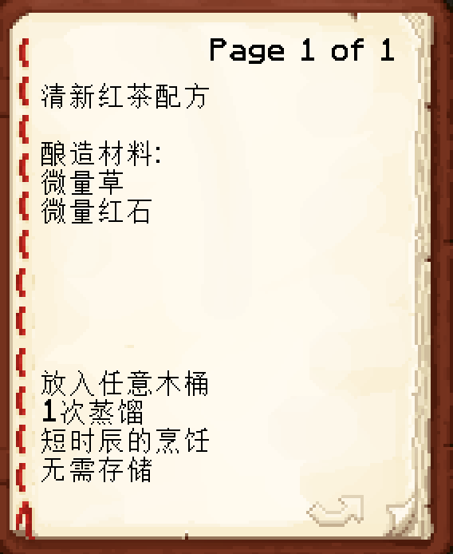

# 酿酒配方

一般的配方如下图所示

##酿造材料

前面的量词指配方所需物品的数量,后方指酿酒需要的物品

以下是图中配方的解读:

1-8物品   微量
9-16物品  少量
17-32物品 适量
33-48物品 多量
49-64物品 大量

改配方可翻译为需要将1-8个草和1-8个红石放入炼药锅中
物品越接近确切数量，星级越高

## 所需木桶

指木桶所需要的木质

共有以下木桶

白桦木  
橡木  
丛林木  
云杉木  
金合欢木  
深色橡木  
诡异菌  
绯红菌  
红树木  
樱花木  
竹子  
切割铜  

使用正确的桶将会提升星级

## 蒸馏次数

指在炼药台中萤石酿造的次数

萤石粉不会被消耗

蒸馏到指定次数会自动停止

## 烹饪时间

指当所有物品放入炼药锅中还需要继续烹饪的时间

**注:** 时辰=分钟

以下是图中配方的解读:

0-3分钟   短时辰烹饪 
4-7分钟   适量时辰烹饪
8-11分钟  较长时辰烹饪
12-15分钟 长时辰烹饪
16-19分钟 长久时辰烹饪

用钟右键便可查看当前烹饪的时间

## 存储年份

指放入木桶的游戏天数
**注:** 1年=1游戏日=20分钟

在存储过程中可随时打开木桶查看进度
**切忌:** 不要在酿造过程中将酒取出, 否则存储过程将直接结束

以下是图中配方的解读:

0-3游戏日   短年份的存储
4-7游戏日   适量年份的存储
8-11游戏日  较长年份的存储
12-15游戏日 长年份的存储
16-19游戏日 长久年份的存储
20-23游戏日 更长久年份的存储
