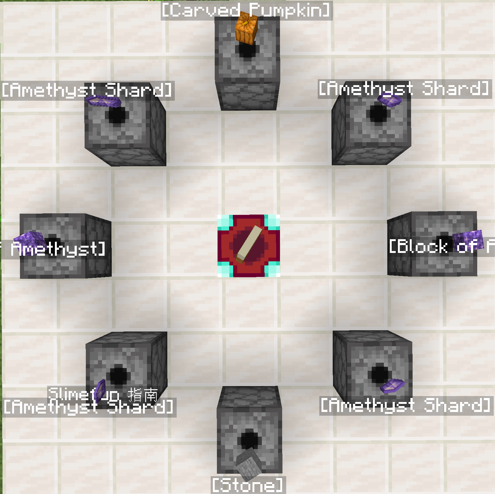
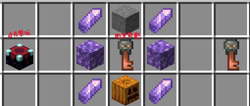
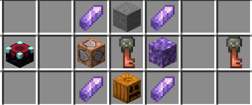

# 特殊玩法

在地牢宝箱中可以开出地牢钥匙

用于合成召唤 BOSS 的钥匙

目前共有 2 个 BOSS 钥匙可合成召唤

**合成需在远古祭坛进行**

**紫晶傀儡**

**Herobrine**

## 召唤方法

在合成完钥匙之后进入地牢

找到地牢房间中的命令方块

用钥匙右键其便可将出生点传送门改为前往 BOSS 房间, 同时地牢倒计时增加10分钟

**注:** 使用钥匙后仍需完成任务, BOSS 算在地牢世界, 死亡不掉落, 同时倒计时结束死亡, 死亡不会获得任何职业经验和金币

## BOSS 掉落物

**紫晶傀儡**

60 点职业经验和 100 金币

7 ~ 12 个怪异的紫水晶

[怪异的紫水晶合成表](/dungeon/dungeon-crafting)