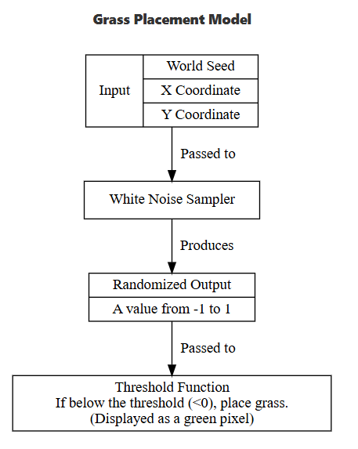
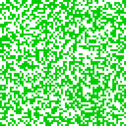
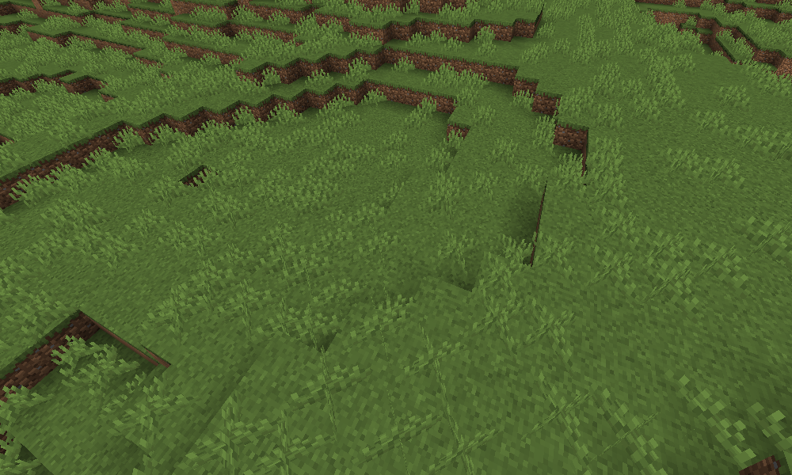
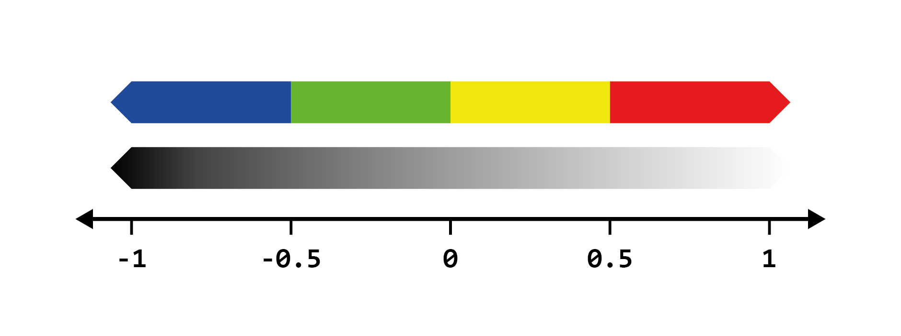

噪声如何分布物体
噪声通过将位置输入采样器后生成的值来决定物体的分布。例如根据方块位置采样值来放置特定方块。

阈值分布法
最简单的噪声分布方式是应用阈值法，即通过判断采样值是否高于或低于某个数值（称为"阈值"）来决定两种状态。

草丛分布示例
假设我们需要在每块草方块上随机生成高草丛。若在所有草方块上都放置会显得不自然，这时二维白噪声采样器配合阈值法就派上用场。




效果演示：

通过这种方法实现了草丛的随机分布。

[图示2：阈值调整对比](picture/grass_64x64_25pcthreshold.png)
- 当阈值降至-0.25时，草丛密度降低（排除了-0.25至0区间的值）
- 提高阈值则会增加草丛密度

列表分布法
噪声值可分割为多类别列表。例如将以下颜色列表通过单纯形噪声分布：
```
colors：
  - blue
  - green
  - yellow
  - red
```
实现原理：
.png) → 
通过设置多个阈值划分噪声值范围：
- 小于-0.5 → 蓝色
- [-0.5,0] → 绿色
- 以此类推

权重列表
通过重复列表项可增加其分布权重，例如：
```
colors:
  - blue:2
  - green:1
  - yellow:1
  - red:1
```
这就是我们所说的加权列表。加权列表通常与噪声采样器结合使用来分发内容。

此时蓝:绿:黄:红的分布比例为2:1:1:1。

Terra系统会自动计算阈值并划分噪声区间，简化权重列表配置流程。
