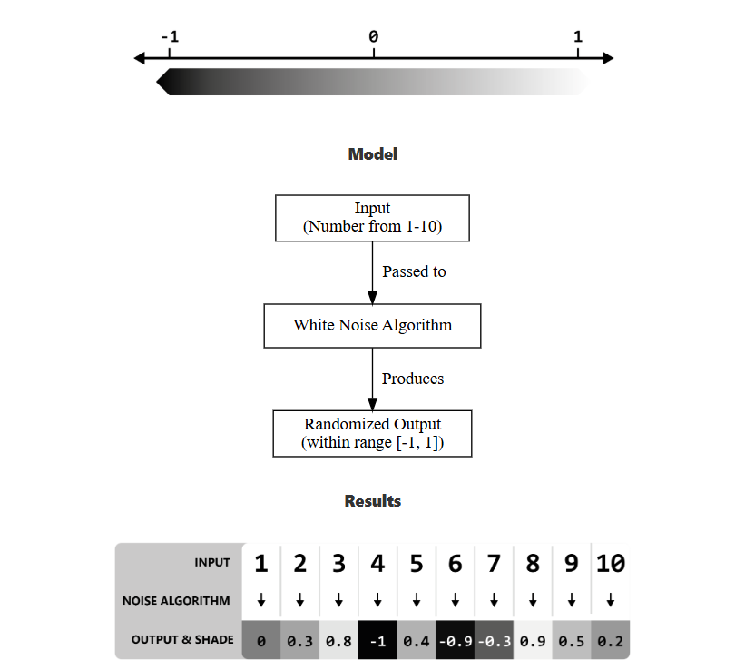
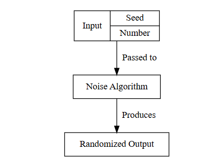
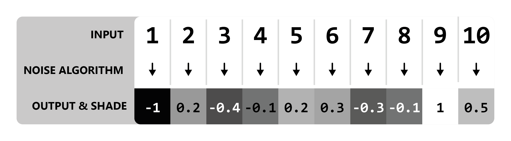
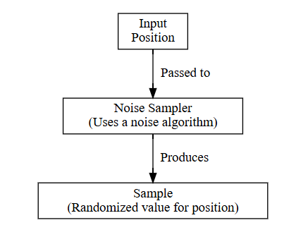
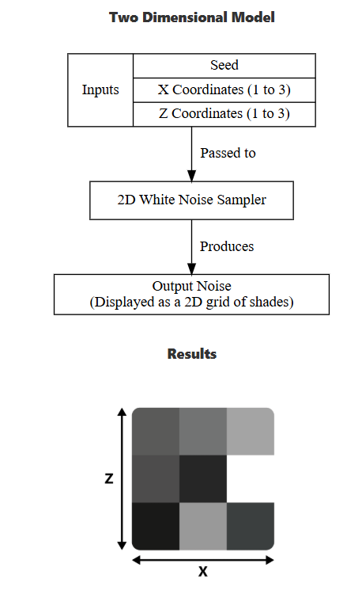
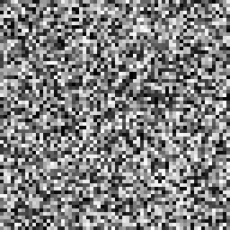
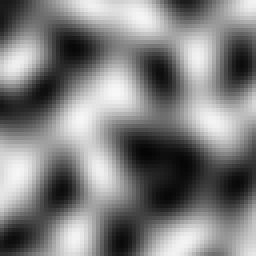

噪声采样器工作原理

噪声基础
我们首先通过一个演示来展示噪声"生成"的最基本过程。使用生成白噪声的噪声算法，输入数字1到10。（理解算法如何精确生成特定数值对于掌握核心概念并非必需）

按照惯例，Terra使用的算法输出值范围在-1到1之间，因此可以将其可视化为灰度值：

很简单对吧？算法所做的只是将一个数字转换为另一个随机数。

注意
为简化说明，输出值已四舍五入至小数点后一位，实际精度更高。

演示中使用整数输入，但噪声算法同样适用于1.5这类输入。

种子值
种子值是噪声算法的额外输入参数：

种子值提供从相同输入获取全新随机数集的途径。种子值必须是整数，例如5324有效，而231.23无效。

以下示例使用两个不同种子值，基于相同输入产生不同输出：

种子=0的白噪声

种子=1的白噪声

你可能熟悉的种子值应用案例是《我的世界》世界种子。原版世界种子会被输入到控制地形生成的多个噪声算法中，每个种子生成截然不同的世界。
--------------------------------
《我的世界》原版世界生成冷知识
旧版本中，某些噪声算法对所有世界使用相同种子（即不考虑世界种子），导致所有世界的特定特征生成方式完全一致。典型案例是控制基岩生成的算法使用固定种子，使得所有世界具有相同的随机基岩分布。
----------------------------------------
噪声采样器
输入噪声算法的通常是世界中的坐标值。例如数字1到10可能代表X轴坐标。这样使用时，噪声算法实质上为坐标描述的每个位置提供随机值。我们将这种使用方式称为噪声采样器。

将坐标输入噪声采样器也称为"采样"。单个坐标的输出值称为"样本"，样本集合构成噪声。

多维采样
前例仅使用单轴坐标输入，但噪声采样器可利用多维坐标定位。

输入二维坐标即进行2D采样，通常使用X和Z轴坐标。

新示例中，我们为X和Z轴设定1-3的范围，共获得9个样本（3×3）。为简化说明省略具体坐标值。

二维模型

增加维度后，噪声可表现为2D网格而非数值列表。

进一步实验：使用64×64采样区域：

这本质上是用白噪声采样器生成随机图像。

默认情况下，我们将以灰度图像形式可视化2D噪声，每个输出值代表一个灰度像素。

更高维度
许多噪声算法支持超过两个输入参数（不含种子），可视为维度数。但在Terra中，噪声采样器仅支持二维或三维。3D采样器使用X、Y、Z三轴。

盐值
噪声采样器使用的种子值为世界种子与盐值之和。盐值可在定义噪声采样器配置时指定，使相同算法产生不同输出。

为原本相同的噪声采样器设置不同盐值，可避免不同事物在相同位置产生相同分布。

确定性
给定任意输入，噪声采样器的输出必须始终一致。因此我们可以通过相同输入可靠地复现任何"随机"结果。用专业术语说，噪声采样器必须具备确定性。

相干噪声
目前我们仅讨论类似电视雪花的噪声，这对许多应用已足够。但如何生成能塑造起伏丘陵、巍峨山脉等结构化随机地形的噪声？这就需要引入"相干噪声"这类新型采样器。

核心差异
随机噪声与相干噪声的关键区别在于：随机噪声采样器产生无明显结构的噪声，而相干噪声采样器产生"结构化"噪声——相邻位置的采样输出值具有相似性。

对比两种采样器在相同输入下的2D采样可视化效果：

随机噪声

相干噪声

可见相干噪声样本具有可辨识的平滑结构，而随机噪声样本无明显规律。上例使用的相干噪声算法称为"单纯形噪声"，是Terra提供的多种噪声类型之一。

噪声变体
Terra包含多种噪声采样器变体及实现，如白噪声和单纯形噪声采样器。每种都有独特特性、行为和应用场景，但都遵循"为每个位置提供数值"的核心原则。

以下是Terra最常用的噪声采样器：
- 单纯形噪声  Simplex Noise
- 细胞/沃罗诺伊/沃利噪声  Cellular / Voronoi / Worley Noise
- 白噪声  White Noise
- 值噪声  Value Noise
- 域扭曲  Domain Warp
- 分形布朗运动  FBM
- 表达式噪声  Expression

完整列表详见NoiseSampler文档。